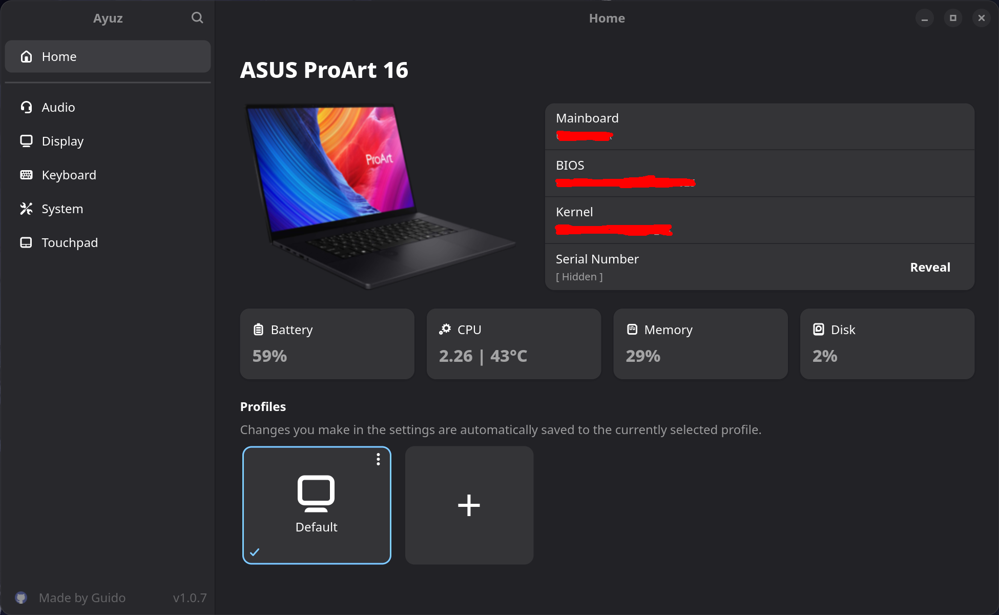
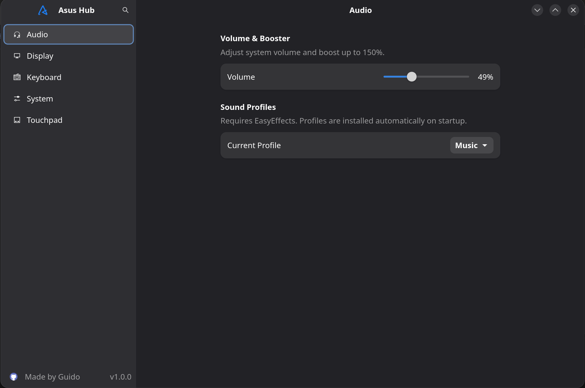
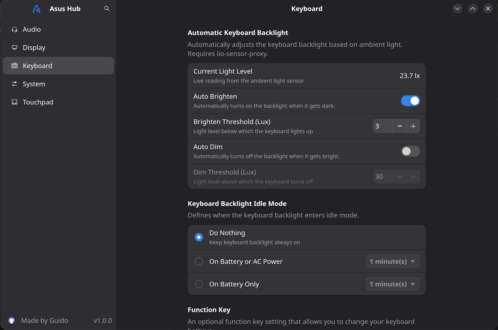
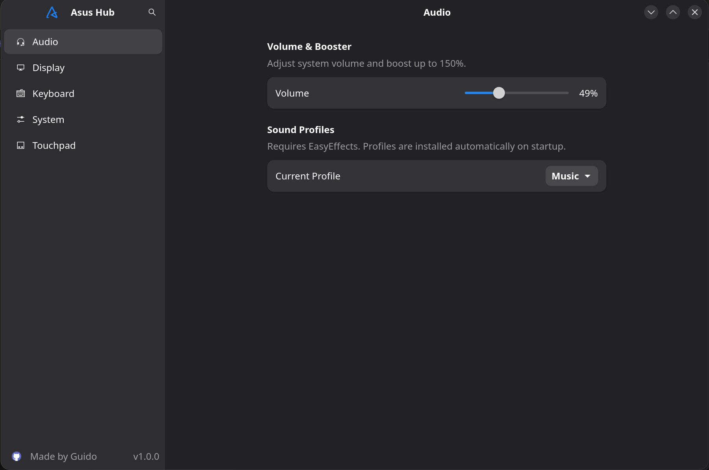
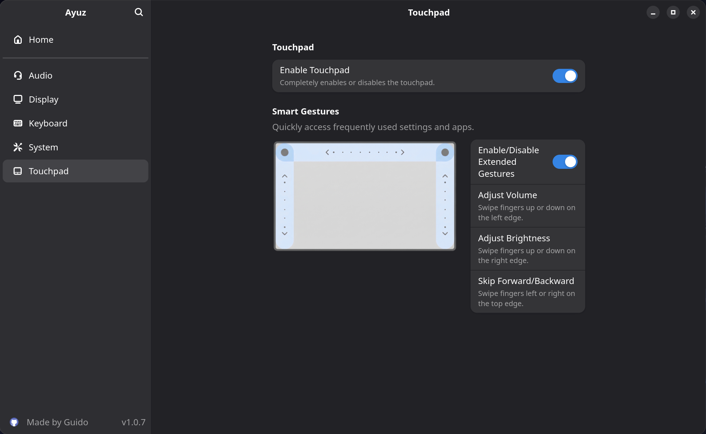
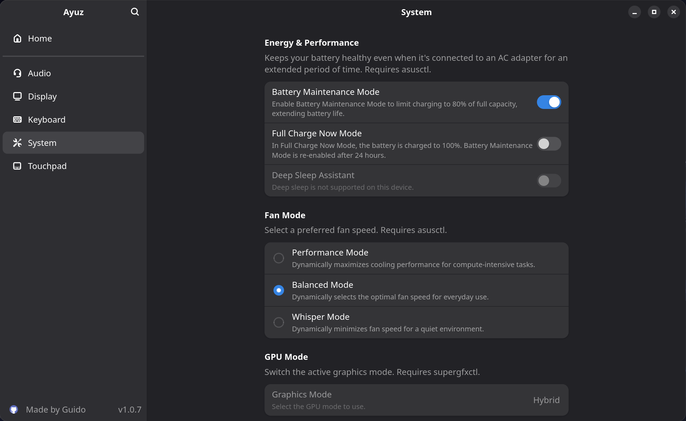

<h1 align="center">
  
  <br>
  Ayuz
</h1>

<p align="center">
  A centralized settings application for ASUS laptops on Linux - bringing together hardware controls, display tuning, audio profiles, and system management in one place.
</p>

<p align="center">
  <strong>Tested on:</strong> ASUS Zenbook S16 · Fedora 43 · KDE Plasma
</p>

---

> [!WARNING]
> **Disclaimer:** This is an unofficial, community-driven, open-source project. **"Asus Hub" is NOT affiliated with, endorsed by, sponsored by, or connected to ASUSTeK Computer Inc. in any way.** "ASUS", "Zenbook", "ROG", "Vivobook", and "MyAsus" are registered trademarks of ASUSTeK Computer Inc. <br>
The use of ASUS trademarks within this website and associated tools and libraries is only to provide a recognisable identifier to users to enable them to associate that these tools will work with ASUS laptops. <br>
This software is provided as-is, without warranty, and uses community reverse-engineered backend tools. Use at your own risk.

---

## Screenshots

<table align="center">
  <tr>
    <td align="center"><br/><em>Homepage</em></td>
    <td align="center"><br/><em>Display Settings</em></td>
  </tr>
  <tr>
  <td align="center"><br/><em>Keyboard Settings</em></td>
  <td align="center"><br/><em>Audio Settings</em></td>
</tr>
<tr>
  <td align="center"><br/><em>Touchpad Settings</em></td>
    <td align="center" colspan="2"><br/><em>System Settings</em></td>
</tr>
</table>

---

## Motivation

ASUS provides the MyAsus application for Windows, offering a unified interface to control display settings, battery care, fan profiles, keyboard backlight, and more. On Linux, no equivalent exists. <br>
Instead, the relevant controls are scattered across a variety of independent tools and configuration files:

- Battery charge limits via `asusctl`
- Audio effects via EasyEffects with manual preset management
- Display brightness quirks via `kscreen-doctor`
- Fan profiles via D-Bus calls to `asusd`
- Keyboard backlight via idle daemons like `swayidle`
- OLED-specific care settings buried in KDE power management config files

Asus Hub aims to consolidate all of these into a single, clean GTK4 interface - making it easy to manage your ASUS laptop on Linux without needing to know which tool controls which feature. <br>
The application is smart about availability: if a required tool or desktop environment is not detected, the corresponding setting is automatically disabled rather than silently failing.

---

## Features

### Display

| Feature                   | Description                                                                                                       | Requires                      |
| ------------------------- | ----------------------------------------------------------------------------------------------------------------- | ----------------------------- |
| OLED Flicker-Free Dimming | Reduces OLED panel flickering at low brightness levels using a 10-100% slider                                     | KDE, `kscreen-doctor`         |
| Color Gamut               | Switch between Native, sRGB, DCI-P3, and Display P3 color profiles - bundled ICC files sourced directly from ASUS | KDE, `kscreen-doctor`         |
| Target Mode               | Dims unfocused windows using the KWin `diminactive` compositor effect                                             | KDE, `qdbus`, `kwriteconfig6` |
| OLED Pixel Refresh        | Activates a pixel refresh screensaver after inactivity to reduce burn-in risk                                     | KDE, `kwriteconfig6`          |
| Panel Auto-Hide           | Automatically hides the KDE panel to reduce static OLED elements                                                  | KDE, `qdbus`                  |
| Panel Transparency        | Sets the KDE panel to transparent or opaque                                                                       | KDE, `qdbus`                  |

> **Bundled color gamut presets:** Native, sRGB, DCI-P3 and Display P3 <br>
> These presets are the original ASUS color gamut profiles.

### Keyboard

| Feature             | Description                                                                    | Requires           |
| ------------------- | ------------------------------------------------------------------------------ | ------------------ |
| Automatic Backlight | Uses the ambient light sensor to automatically adjust keyboard brightness      | `iio-sensor-proxy` |
| Backlight Idle Mode | Turns off backlight after inactivity (1/2/5 min), configurable per power state | `swayidle`         |
| FN Key Mode         | Toggle between function key priority (F1-F12) and shortcut priority            | `asusd`            |

### Touchpad

| Feature         | Description                                                               | Requires     |
| --------------- | ------------------------------------------------------------------------- | ------------ |
| Smart Gestures  | Control volume, brightness, and media playback via touchpad edge swipes   | -            |
| Touchpad Toggle | Enable or disable the touchpad, with a 10-second auto-revert safety timer | KDE or GNOME |

### Audio

| Feature        | Description                                                | Requires      |
| -------------- | ---------------------------------------------------------- | ------------- |
| Volume & Boost | Control system volume from 0-150% via PipeWire             | `wpctl`       |
| Sound Profiles | Apply EasyEffects presets bundled with the app (see below) | `easyeffects` |

> **Bundled EasyEffects presets:** Movie, Music, Perfect EQ, Video, Voice, Custom <br>
> These presets are **not** the original ASUS audio profiles - they are [Community Presets](https://github.com/wwmm/easyeffects/wiki/Community-presets) from the EasyEffects project, included for convenience. They are automatically installed to the EasyEffects preset directory on first use.

### System

| Feature                  | Description                                                                                                                                                   | Requires      |
| ------------------------ | ------------------------------------------------------------------------------------------------------------------------------------------------------------- | ------------- |
| Battery Maintenance Mode | Limit charging to 80% for long-term battery health                                                                                                            | `asusd`       |
| Full Charge              | Charge to 100% with automatic revert to maintenance mode after 24 hours                                                                                       | `asusd`       |
| Deep Sleep               | Switch between `s2idle` and `deep` suspend modes                                                                                                              | -             |
| Fan Profiles             | Switch between Performance, Balanced, and Quiet fan curves                                                                                                    | `asusd`       |
| GPU Mode                 | Switch between GPU modes: Hybrid, Integrated, Nvidia (No Modeset), VFIO, ASUS eGPU, and ASUS MUX Discrete. Switching GPU modes requires a full system reboot. | `supergfxctl` |
| GPU Memory Allocation    | Reserve system RAM for the integrated GPU (UMA Frame Buffer). Options: Auto, 1-8 GB. Requires a supported BIOS. Changes require a full system reboot.         | `asusd`       |

### General

- **Profiles** - create and manage multiple named configuration profiles, each with a custom icon. Settings are automatically saved to the currently selected profile and instantly restored when switching
- **Global search** - search across all settings with a keyboard shortcut
- **System tray** - minimize to tray, restore or quit from tray menu
- **Autostart** - optional autostart with the system; when enabled, the app launches hidden (`--hidden`) and only appears in the tray. Managed via a `.desktop` file at `~/.config/autostart/de.guido.asus-hub.desktop`
- **Persistent configuration** - settings are saved to `~/.config/asus-hub/config.json` and restored on every launch
- **Multilingual UI** - English and German supported, switchable at runtime
- **Toast notifications** - errors and status messages shown as non-blocking toasts

---

## Dependencies

Asus Hub integrates with several external tools and system services. Install only the ones relevant to the features you want to use.

| Dependency                                                 | Purpose                                                          | Package (Fedora)              |
| ---------------------------------------------------------- | ---------------------------------------------------------------- | ----------------------------- |
| [`asusctl`](https://gitlab.com/asus-linux/asusctl)         | Battery care, fan profiles, FN key mode                          | `asusctl` (copr)              |
| `asusd`                                                    | System daemon required by asusctl                                | bundled with `asusctl`        |
| [`supergfxctl`](https://gitlab.com/asus-linux/supergfxctl) | GPU mode switching (Hybrid, Integrated, Nvidia, VFIO, eGPU, MUX) | `supergfxctl` (copr)          |
| [`easyeffects`](https://github.com/wwmm/easyeffects)       | Audio sound profiles                                             | `easyeffects`                 |
| `kscreen-doctor`                                           | OLED flicker-free dimming                                        | `kscreen`                     |
| `iio-sensor-proxy`                                         | Ambient light sensor for auto backlight                          | `iio-sensor-proxy`            |
| `swayidle`                                                 | Keyboard backlight idle timer                                    | `swayidle`                    |
| `wpctl`                                                    | PipeWire volume control                                          | bundled with `pipewire-utils` |
| `qdbus`                                                    | KDE-specific D-Bus calls (KDE features)                          | `qt6-tools`                   |
| `kwriteconfig6`                                            | KDE config file access (KDE features)                            | `kf6-kconfig`                 |
| `gsettings`                                                | Touchpad toggle on GNOME                                         | `glib2`                       |

> Features that depend on a missing tool or an incompatible desktop environment are automatically disabled in the UI.

---

## Hardware & OS Compatibility

The application has been developed and tested on:

- **Laptop:** ASUS Zenbook S16
- **OS:** Fedora 43
- **Desktop:** KDE Plasma (Wayland)

Other ASUS laptops are likely supported to varying degrees. Features relying on `asusd` (battery, fan, FN key) depend on your device being supported by asusctl. Check the [asusctl device support list](https://gitlab.com/asus-linux/asusctl) for compatibility. <br>
Other Linux distributions should work as long as the relevant dependencies can be installed. Features are individually guarded against missing tools, so the app remains usable even if only some dependencies are available.

---

## Installation

### 1. Prerequisites

**Note:** If you plan to use the AppImage (see Step 5), you can skip this step entirely. The AppImage already bundles all the necessary UI dependencies.

- Rust toolchain (install via [rustup](https://rustup.rs))
- GTK4 and Libadwaita development libraries

**Fedora:**

```bash
sudo dnf install gtk4-devel libadwaita-devel
```

**Arch:**

```bash
sudo pacman -S gtk4 libadwaita
```

### 2. Install external tools

Most tools are already included with a standard Fedora KDE installation (`kscreen-doctor`, `kwriteconfig6`, `wpctl`). The following need to be installed manually: <br>
**asusctl** (via COPR - see [asus-linux.org](https://asus-linux.org) for full documentation):

```bash
sudo dnf copr enable lukenukem/asus-linux
sudo dnf update
sudo dnf install asusctl supergfxctl
sudo dnf update --refresh
sudo systemctl enable supergfxd.service
```

### 3. Reboot after installation

### 4. Remaining tools:

```bash
sudo dnf install easyeffects iio-sensor-proxy swayidle
```

### 5. Download & Install

**Arch Linux (AUR):**

The application is available in the Arch User Repository. Install using your preferred AUR helper:

| Package        | Description                                              |
| -------------- | -------------------------------------------------------- |
| `asus-hub`     | Compiles the latest stable release from source           |
| `asus-hub-bin` | Downloads and installs the pre-compiled binary (fastest) |
| `asus-hub-git` | Compiles the latest commit from the main branch          |

```bash
yay -S asus-hub-bin
```

**Fedora (Copr - Community Maintained):**

A community member has packaged Asus Hub for Fedora via Copr, providing automatic rebuilds and updates. <br>
**Note:** This repository is maintained by the community [SkyR0ver](https://github.com/SkyR0ver/asus-hub-rpm), not officially by the upstream project. Currently supported on Fedora 43+.

```bash
sudo dnf copr enable lukenukem/asus-linux
sudo dnf copr enable skyr0ver/asus-hub
sudo dnf install asus-hub
sudo systemctl enable --now supergfxd.service
```

**Manual Download:**

Download the package matching your distribution from the [GitHub Releases](https://github.com/Traciges/asus-hub/releases) page:

- **Fedora / RPM-based:**

  ```bash
  sudo dnf install ./asus-hub-1.0.6-1.x86_64.rpm
  ```

- **Debian / Ubuntu / DEB-based:**

  ```bash
  sudo apt install ./asus-hub_1.0.6-1_amd64.deb
  ```

- **AppImage (any distribution):**
  ```bash
  chmod +x asus-hub-1.0.6-1.AppImage
  ./asus-hub-1.0.6-1.AppImage
  ```

### Uninstall

- **Fedora, CentOS oder RHEL (via RPM/DNF):**

  ```bash
  sudo dnf remove asus-hub
  ```

- **Ubuntu, Debian oder Linux Mint (via DEB/APT):**

  ```bash
  sudo apt remove asus-hub
  ```

- **openSUSE (via RPM/Zypper):**
  ```bash
  sudo zypper remove asus-hub
  ```

### Build from source

```bash
git clone https://github.com/Traciges/asus-hub
cd asus-hub
cargo build --release
./target/release/asus-hub
```

### Build an AppImage

Requires [`appimagetool`](https://github.com/AppImage/AppImageKit/releases) on your `$PATH`.

```bash
cargo install cargo-appimage
cargo appimage
./target/appimage/asus-hub-1.0.6-1.AppImage
```

---

## Contributing

Contributions are welcome. If you own a different ASUS laptop model and want to add or fix support for specific features, feel free to open an issue or pull request.

When adding a new feature, follow the existing component pattern in `src/components/` and add corresponding translation keys to both `locales/en.yml` and `locales/de.yml`.

---

## License

This project is licensed under the [GNU General Public License v3.0](LICENSE).
